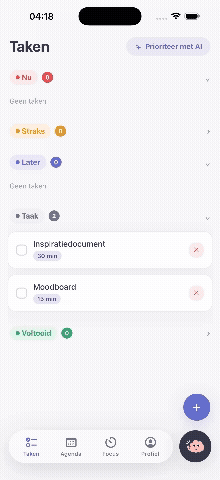
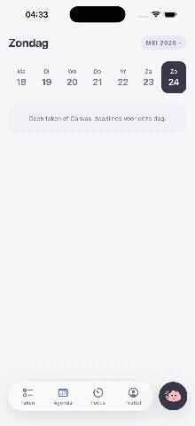
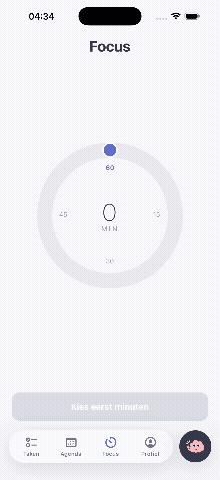
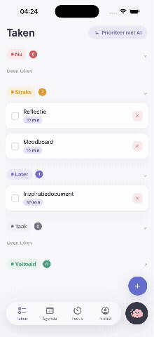

<p align="center">
  
</p>

# Mindo

**Mindo is jouw tweede brein voor studie en planning.**

Mindo helpt studenten om overzicht te houden over taken, deadlines en studieplanning. De app is ontworpen voor studenten die moeite hebben met prioriteren, plannen of het starten van taken.

**Online proberen:** [mindo-app-ouassila.vercel.app](https://mindo-app-ouassila.vercel.app)

---

## Waarom Mindo?

Veel studenten gebruiken losse tools zoals Canvas, agenda's, notities en AI-tools naast elkaar. Hierdoor raakt informatie verspreid en wordt het lastig om overzicht te houden.

Mindo brengt deze informatie samen in één omgeving en helpt gebruikers om te bepalen wat nu echt belangrijk is.

---

## Preview

<table border="0" cellspacing="0" cellpadding="8">
  <tr>
    <td align="left"></td>
    <td align="left"></td>
    <td align="left"></td>
    <td align="left"></td>
  </tr>
</table>

---

## Functionaliteiten

### Takenbeheer

- Taken toevoegen, bewerken en afronden
- Indeling in Nu, Straks, Later en Voltooid
- Prioriteiten visueel onderscheiden

### AI-prioritering

- Analyseert open taken
- Plaatst taken automatisch in de juiste categorie
- Helpt bij het bepalen van de volgende stap

### Braindump

- Schrijf snel alles op wat in je hoofd zit
- Laat AI structuur aanbrengen
- Zet losse gedachten om in concrete taken

### Agenda

- Week- en maandoverzicht
- Deadlines op één centrale plek
- Koppeling met Canvas-opdrachten

### Focusmodus

- Minimalistische focussessie
- Timer voor geconcentreerd werken
- Helpt bij het starten van taken

---

## Gebouwd met


---

## Proberen

### Online versie

Open de app direct in je browser. Geen installatie nodig:

🔗 **[mindo-app-ouassila.vercel.app](https://mindo-app-ouassila.vercel.app)**

Log in met het [testaccount](#testaccount) om alle functies uit te proberen.

### Lokaal starten

**1. Repository clonen en dependencies installeren**

```bash
git clone https://github.com/ouassilabenhammou/mindo-app.git
cd mindo-app
npm install
```

**2. Omgevingsvariabelen instellen**

Maak een `.env` aan in de root:

```
EXPO_PUBLIC_SUPABASE_URL=...
EXPO_PUBLIC_SUPABASE_ANON_KEY=...
```

**3. Development server starten**

```bash
npm start
```

Scan daarna de QR-code met **Expo Go** (iOS/Android), of kies in de terminal:

| Toets | Platform         |
| ----- | ---------------- |
| `w`   | Webbrowser       |
| `i`   | iOS Simulator    |
| `a`   | Android Emulator |

Of start direct een specifiek platform:

```bash
npm run web      # alleen web
npm run ios      # iOS Simulator
npm run android  # Android Emulator
```

---

## Doelgroep

Mindo is ontwikkeld voor HBO-studenten die behoefte hebben aan meer structuur, overzicht en ondersteuning bij het plannen van hun studie.

---

## Ontwikkelaar

Ontwikkeld door Ouassila Ben Hammou als persoonlijk project binnen Fontys ICT.
